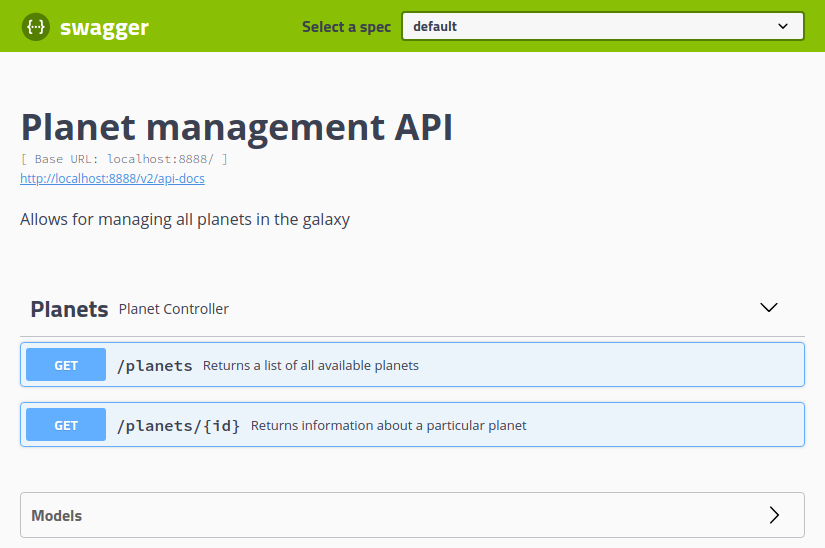

# Springfox Swagger client code generation example


This project is a sample REST service documented using Springfox Swagger, 
with automatic Angular client code generation done using Swagger Codegen CLI.

To learn how to generate client code from Spring Boot using Springfox Swagger, read the post:

[Code Soapbox - Generate client code From Spring Boot using Springfox Swagger](https://code.danielfrak.com/generate-client-code-from-spring-boot-using-swagger/)

## Getting Started

1. Clone the repository
```bash
$ git clone https://github.com/daniel-frak/swagger-client-code-generation.git
```

2. Build the application
```bash
$ mvn clean install
```

## Built With

* Java 8
* [Spring Boot 2.1.8](https://start.spring.io/)
* [Maven](https://maven.apache.org/)
* [Springfox Swagger](https://springfox.github.io/springfox/)
* [Swagger Codegen](https://swagger.io/tools/swagger-codegen/)

## Screenshots


## License

This project is licensed under the MIT License - see the [license details](https://opensource.org/licenses/MIT).